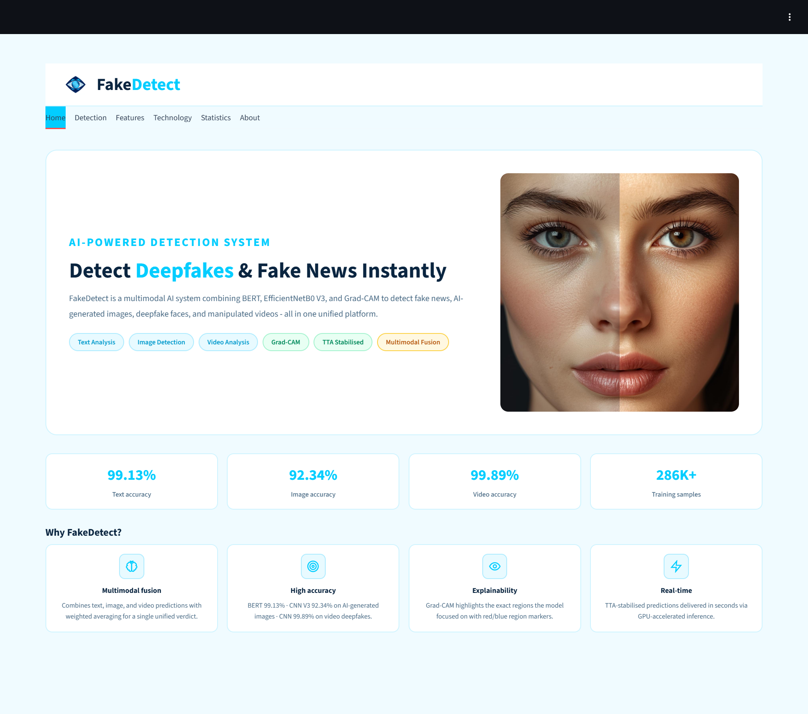
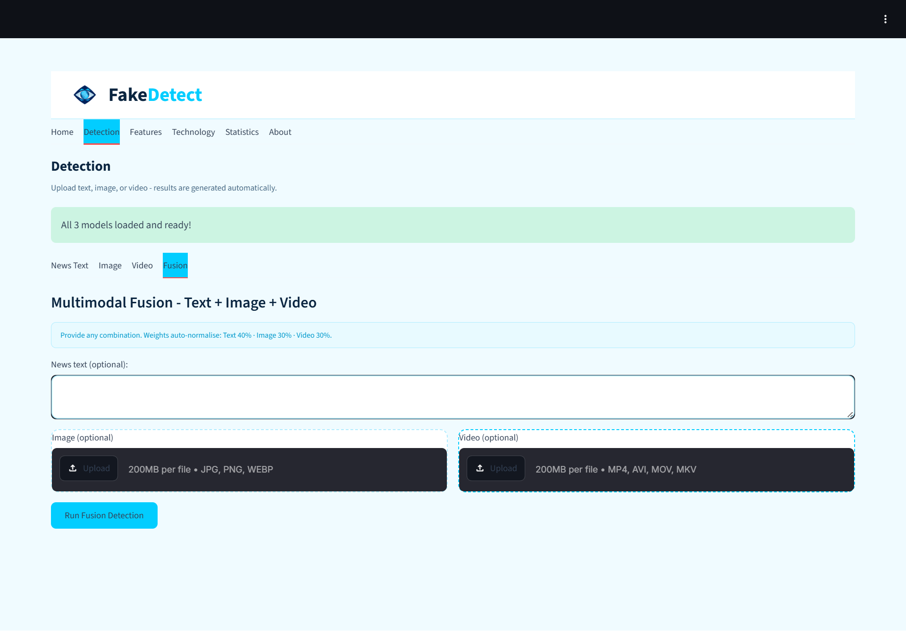
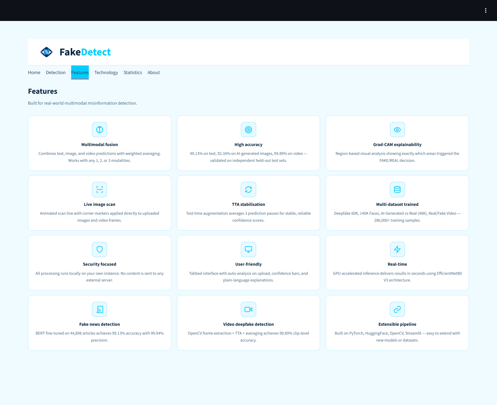
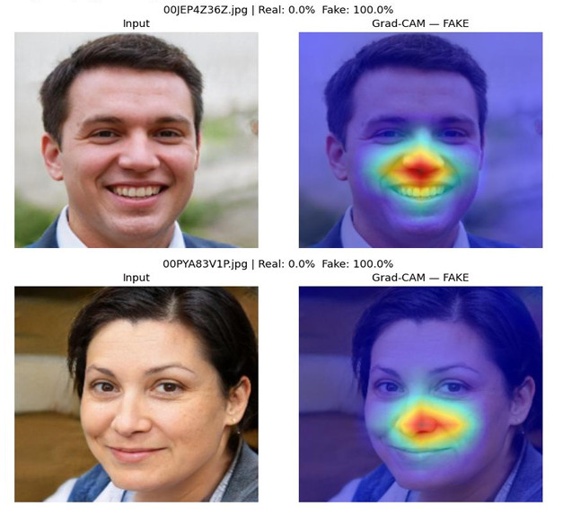

# FakeDetect: AI-Driven Multimodal Fake News and Deepfake Detection System

<p align="center">
  
</p>

<p align="center">
  An AI-driven multimodal system for detecting fake news, manipulated images, and deepfake videos using BERT, EfficientNetB0, and multimodal fusion.
</p>

---

## Overview

FakeDetect is an AI-driven multimodal detection system developed to identify misinformation across text, images, and videos within a unified framework.

The system combines Natural Language Processing and Computer Vision techniques to analyze different forms of potentially misleading content. A fine-tuned BERT model is used for text-based fake news detection, while EfficientNetB0-based models are used for image and video analysis. Predictions from the available modalities can then be combined using a multimodal fusion strategy to produce an overall assessment.

The system also incorporates Grad-CAM-based visual explainability for image predictions, allowing users to understand which regions of an image contributed to the model's decision.

The application is implemented using Streamlit and provides an interactive interface for performing fake content detection.

---

## Key Features

- Fake news detection using a fine-tuned BERT model
- Deepfake and manipulated image detection using EfficientNetB0
- Video analysis using frame extraction and CNN-based classification
- Multimodal fusion of predictions from multiple input modalities
- Confidence scores for model predictions
- Grad-CAM visual explanations for image predictions
- Interactive Streamlit web interface
- Separate analysis pipelines for text, images, and videos

---

## System Architecture

FakeDetect consists of three primary detection pipelines:

### Text Detection

The text module uses a fine-tuned BERT model to classify news content as real or fake.

### Image Detection

The image module uses an EfficientNetB0-based convolutional neural network to identify manipulated and AI-generated images.

### Video Detection

The video module extracts frames using OpenCV and applies the trained image classification model to analyze the extracted frames.

### Multimodal Fusion

When multiple modalities are available, their prediction scores are combined using a weighted fusion strategy. The fusion process allows information from text, images, and videos to contribute to the final assessment.

A simplified representation of the workflow is:

<p align="center">
  
</p>

---

## Models

### BERT — Fake News Detection

A fine-tuned BERT model is used for classifying textual news content.

The model is based on:

```text
bert-base-uncased
```

The text pipeline performs preprocessing and tokenization before passing the input to the fine-tuned BERT classifier.

### EfficientNetB0 — Image Detection

EfficientNetB0 is used as the primary convolutional neural network architecture for image-based fake content detection.

The model is fine-tuned for binary classification of real and manipulated/AI-generated content.

### EfficientNetB0 — Video Detection

For video analysis, frames are extracted from the uploaded video using OpenCV. The trained CNN model analyzes the extracted frames and their predictions are aggregated to obtain a video-level assessment.

---

## Model Performance

The principal model evaluation results obtained during the project are summarized below.

| Model | Accuracy | Precision | Recall | F1-Score |
|---|---:|---:|---:|---:|
| BERT – Fake News Detection | 99.13% | 99.94% | 98.40% | 99.16% |
| EfficientNetB0 – Image Detection | 92.34% | 91.32% | 93.58% | 92.44% |
| EfficientNetB0 – Video Detection | 99.89% | 99.75% | 100.00% | 99.88% |

These results represent the evaluation of the individual detection modules. The multimodal fusion component combines predictions from the available modalities and is intended to provide an integrated assessment rather than replace the individual model evaluations.

---

## Datasets

The project uses publicly available datasets obtained from Kaggle for model training and evaluation.

| Dataset | Size | Purpose |
|---|---:|---|
| Fake and Real News Dataset | 44,898 articles | BERT training |
| LIAR Dataset | 12,836 statements | Secondary text classification |
| Deepfake vs Real Images | 190,335 images | Deepfake image detection |
| 140K Real and Fake Faces | 140,000 images | Face manipulation detection |
| AI-Generated vs Real Images | 48,000 images | AI-generated image detection |
| Real/Fake Video Dataset | 872 videos | Video detection |

### Dataset Sources

- [Fake and Real News Dataset](https://www.kaggle.com/datasets/clmentbisaillon/fake-and-real-news-dataset)
- [LIAR Dataset](https://www.kaggle.com/datasets/mrisdal/fake-news)
- [Deepfake vs Real Images](https://www.kaggle.com/datasets/manjilkarki/deepfake-and-real-images)
- [140K Real and Fake Faces](https://www.kaggle.com/datasets/xhlulu/140k-real-and-fake-faces)
- [AI-Generated vs Real Images](https://www.kaggle.com/datasets/tristanzhang32/ai-generated-images-vs-real-images)
- [Real/Fake Video Dataset](https://www.kaggle.com/datasets/mohammadsarfrazalam/realfake-video-dataset)

---

## Technologies Used

| Category | Technologies |
|---|---|
| Programming Language | Python |
| Deep Learning | PyTorch, TorchVision |
| Natural Language Processing | Hugging Face Transformers, BERT |
| Computer Vision | EfficientNetB0, OpenCV |
| Image Processing | PIL / Pillow |
| Natural Language Processing | NLTK |
| Data Processing | NumPy, Pandas |
| Model Evaluation | Scikit-learn |
| Explainable AI | Grad-CAM |
| Visualization | Matplotlib, Seaborn |
| Application Framework | Streamlit |
| Development Environment | Google Colab, Jupyter Notebook |

---

## Explainability

FakeDetect incorporates Grad-CAM to provide visual explanations for image-based predictions.

Grad-CAM generates a heatmap highlighting image regions that contributed to the model's classification. This provides an additional level of interpretability beyond the final real/fake prediction.

The visualization can help users understand which areas of an image influenced the CNN's decision.

---

## Project Structure

The repository contains the application code, trained CNN models, notebooks, documentation, and supporting resources.

```text
FakeDetect/
│
├── app/
│   ├── app_screenshots/
│   │   ├── About.png
│   │   ├── Detection.png
│   │   ├── Features.png
│   │   ├── Home.png
│   │   ├── Statistics.png
│   │   └── Technology.png
│   │
│   └── streamlit_app.py
│
├── documentation/
│   ├── Documentation.pdf
│   └── FakeDetect Project PPT.pdf
│
├── images/
│   ├── Architecture Overview.png
│   ├── BERT layer.png
│   ├── Efficientnet layer.png
│   ├── Fake&Deepfake Intro.png
│   ├── FakeDetect Taxonomy.png
│   ├── Input layer.png
│   ├── Multimodal layer.png
│   ├── Overall FakeDetect System.png
│   ├── Preprocessing layer2.png
│   ├── Proposed system.png
│   ├── Tools&Technologies.png
│   ├── bert workflow.png
│   ├── cover_page.png
│   ├── efficientnet workflow.png
│   ├── fake_news.png
│   ├── hero_image.png
│   ├── image_detect.png
│   ├── logo1.png
│   └── video_detect.png
│
├── models/
│   ├── bert_model/
│   │   ├── config.json
│   │   ├── special_tokens_map.json
│   │   ├── tokenizer_config.json
│   │   └── vocab.txt
│   │
│   └── cnn_model/
│       ├── efficientnet_combined_final...
│       ├── efficientnet_v2_best.pth
│       ├── efficientnet_v3_best.pth
│       └── efficientnet_video_finetuned...
│
├── notebooks/
│   ├── 01_fake_news_model.ipynb
│   ├── 02_deepfake_model.ipynb
│   ├── 03_combined_cnn_training.ipynb
│   ├── 04_AI_CGI_Training.ipynb
│   ├── 05_fusion_model.ipynb
│   └── 06_streamlit_app.ipynb
│
├── results/
│   ├── Image_Detection_1.png
│   ├── Image_Detection_2.png
│   ├── Text_Detection.png
│   ├── V3_Confusion_Matrix.png
│   ├── Video_Detection.png
│   ├── ...
│   └── video_finetuned_confusion.png
│
├── LICENSE
├── README.md
└── requirements.txt
```


---

## Installation

### Prerequisites

- Python 3.8 or later
- Git
- Sufficient RAM and storage for model execution
- GPU recommended for training and faster inference

### Clone the Repository

```bash
git clone https://github.com/YOUR_USERNAME/FakeDetect.git
cd FakeDetect
```

### Install Dependencies

```bash
pip install -r requirements.txt
```

---

## Model Files

The CNN model files included in the repository are stored as `.pth` files.

The fine-tuned BERT model is not included in the GitHub repository because the `model.safetensors` file exceeds GitHub's standard file-size limit.

### Fine-Tuned BERT Model

The fine-tuned BERT model can be downloaded from Google Drive:

**BERT Model:**  
https://drive.google.com/file/d/1ly5IKEebgaIOsdapYb105VvxpkbsajhY/view?usp=sharing

After downloading the model, place the BERT model files in:

```text
models/
└── bert_model/
```

The required BERT directory should contain the model and tokenizer configuration files required by the application.

---

## Running the Application

### Run Locally

After installing the dependencies and placing the required model files in their expected locations, launch the application with:

```bash
streamlit run app.py
```

The Streamlit interface will then be available through the local URL provided by Streamlit.

### Google Colab

The project can also be executed through Google Colab using a Streamlit-compatible setup.

The notebooks included in the repository provide the training and development workflow used during the project.

---

## Application Workflow

The application supports analysis through separate detection modules.

### Text Analysis

1. Enter or paste a news article or textual content.
2. The text is preprocessed and tokenized.
3. The fine-tuned BERT model analyzes the input.
4. The system returns the predicted class and confidence score.

### Image Analysis

1. Upload an image.
2. The image is resized and preprocessed.
3. EfficientNetB0 performs binary classification.
4. The system displays the prediction and confidence score.
5. Grad-CAM can be used to visualize important image regions.

### Video Analysis

1. Upload a video.
2. Frames are extracted using OpenCV.
3. Selected frames are processed by the CNN model.
4. Frame-level predictions are aggregated.
5. The application produces a video-level assessment.

### Multimodal Analysis

When more than one modality is available, the individual model predictions are passed to the multimodal fusion component.

The fusion mechanism combines the available prediction scores using predefined weights and produces an integrated assessment.

---

## Screenshots

### Home Page

<p align="center">
  
</p>

### Detection Interface

<p align="center">
  
</p>

### Features

<p align="center">
  
</p>

### Grad-CAM Visualization

<p align="center">
  
</p>

---

## Demonstration

A working demonstration of the FakeDetect application is available through the project demo video.

**Demo Video:**  
https://drive.google.com/file/d/1Sm70r5IAE4iVlW2FN_EAn7YJ8oj883Ih/view?usp=drive_link

The demonstration covers the major components of the application, including:

- Application home page
- Fake news detection
- Image detection
- Video detection
- Multimodal analysis
- Prediction confidence
- Grad-CAM visualization

---

## Applications

The proposed system can be applied to several areas where verification of digital content is important:

- News and media verification
- Social media monitoring
- Digital journalism
- Cybersecurity
- Digital forensics
- Content moderation
- Media authenticity analysis

---

## Limitations

The current system has several limitations:

- Text-based detection is primarily designed for English-language content.
- The image model's performance depends on the characteristics of the datasets used during training.
- Video analysis is based on sampled video frames rather than continuous temporal analysis.
- The current system does not perform audio deepfake detection.
- Detection performance may vary for manipulation techniques that are significantly different from those represented in the training datasets.
- The application currently relies on locally available model files when executed outside a hosted environment.

---

## Future Enhancements

Future development can extend FakeDetect in several directions:

- Multilingual fake news detection using multilingual transformer models
- Audio deepfake detection
- Temporal modeling for improved video analysis
- Learned multimodal fusion instead of fixed fusion weights
- Real-time social media content analysis
- Browser extension for online content verification
- Mobile application deployment
- REST API integration
- Real-time video stream analysis

---

## Project Documentation

Additional project materials are available in the repository:

- Project report
- Project presentation
- Training notebooks
- Model files
- Application source code
- Evaluation outputs

---

## References

1. Devlin, J., Chang, M. W., Lee, K., & Toutanova, K. (2019). *BERT: Pre-training of Deep Bidirectional Transformers for Language Understanding*. NAACL-HLT.

2. Tan, M., & Le, Q. V. (2019). *EfficientNet: Rethinking Model Scaling for Convolutional Neural Networks*. ICML.

3. Selvaraju, R. R., et al. (2017). *Grad-CAM: Visual Explanations from Deep Networks via Gradient-Based Localization*. ICCV.

4. Tolosana, R., et al. (2020). *DeepFakes and Beyond: A Survey of Face Manipulation and Fake Detection*. Information Fusion.

5. Wolf, T., et al. (2020). *Transformers: State-of-the-Art Natural Language Processing*. EMNLP.

---

## Author

**Pravalika Ravalkol**

M.Sc. Computer Science  
Final Year Major Project

---

## License

This project is licensed under the MIT License. See the `LICENSE` file for details.
