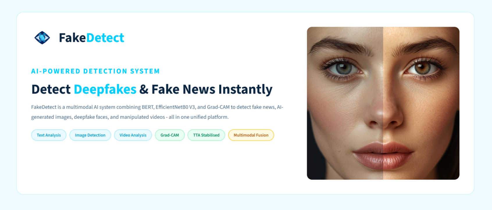

# FakeDetect: AI-Driven Multimodal Fake News and Deepfake Detection System

## Overview

FakeDetect is an AI-driven multimodal detection system developed to identify fake news, manipulated images, and deepfake videos through a unified artificial intelligence framework. The system combines Natural Language Processing and Computer Vision techniques to analyze textual and visual content independently before integrating their predictions using a multimodal fusion strategy.

Unlike conventional systems that operate on a single modality, FakeDetect simultaneously processes news articles, images, and videos to provide a more reliable final prediction with confidence scores and visual explanations.

The application is deployed using Streamlit, enabling real-time detection through an interactive web interface.

---

## Key Features

- Fake news detection using a fine-tuned BERT model
- Deepfake image detection using EfficientNetB0
- Deepfake video detection using EfficientNetB0 with OpenCV
- Multimodal fusion of text, image, and video predictions
- Grad-CAM visualization for model explainability
- Confidence score for every prediction
- Interactive Streamlit-based web application

---

## System Architecture

The proposed architecture consists of three independent detection pipelines:

- Text Pipeline using BERT
- Image Pipeline using EfficientNetB0
- Video Pipeline using EfficientNetB0 and OpenCV

Each module generates a prediction score, which is combined through a weighted multimodal fusion layer to produce the final verdict.

---

## Technologies

| Category | Technologies |
|-----------|--------------|
| Programming Language | Python |
| Deep Learning | PyTorch, TorchVision |
| Natural Language Processing | Hugging Face Transformers, BERT |
| Computer Vision | EfficientNetB0, OpenCV |
| Data Processing | Pandas, NumPy, NLTK |
| Explainability | Grad-CAM |
| Visualization | Matplotlib, Seaborn |
| Deployment | Streamlit |
| Development Environment | Google Colab, Jupyter Notebook |

---

## Datasets

The project has been trained using publicly available datasets collected from Kaggle.

| Dataset | Samples | Purpose |
|-----------|---------|---------|
| Fake and Real News Dataset | 44,898 | Fake news detection |
| LIAR Dataset | 12,836 | Political statement verification |
| Deepfake vs Real Images | 190,335 | Deepfake image detection |
| 140K Real and Fake Faces | 140,000 | Face manipulation detection |
| AI Generated vs Real Images | 48,000 | AI-generated image detection |
| Real/Fake Video Dataset | 872 videos | Deepfake video detection |

Dataset Links

- Fake and Real News Dataset: https://www.kaggle.com/datasets/clmentbisaillon/fake-and-real-news-dataset
- LIAR Dataset: https://www.kaggle.com/datasets/doanquanvietnamca/liar-dataset
- Deepfake vs Real Images: https://www.kaggle.com/datasets/manjilkarki/deepfake-and-real-images
- 140K Real and Fake Faces: https://www.kaggle.com/datasets/xhlulu/140k-real-and-fake-faces
- AI Generated vs Real Images: https://www.kaggle.com/datasets/cashbowman/ai-generated-images-vs-real-images
- Real/Fake Video Dataset: https://www.kaggle.com/datasets/mohammadsarfrazalam/realfake-video-dataset

---

## Model Performance

| Module | Accuracy | Precision | Recall | F1-Score |
|---------|----------|-----------|---------|----------|
| BERT (Fake News Detection) | 99.13% | 99.94% | 98.40% | 99.16% |
| EfficientNetB0 (Image Detection) | 92.34% | 91.32% | 93.58% | 92.44% |
| EfficientNetB0 (Video Detection) | 99.89% | 99.75% | 100.00% | 99.88% |

---

## Download Required Files

Some files are hosted externally because they exceed GitHub's file size limit.

### Fine-tuned BERT Model

Download:

https://drive.google.com/file/d/1ly5IKEebgaIOsdapYb105VvxpkbsajhY/view?usp=sharing

---

### Demonstration Video

Project demonstration video:

https://drive.google.com/file/d/1Sm70r5IAE4iVlW2FN_EAn7YJ8oj883Ih/view?usp=drive_link

---

## Applications

- Fake news verification
- Social media monitoring
- Digital journalism
- Cybersecurity
- Digital forensics
- Content moderation
- Media authenticity verification

---

## Future Enhancements

- Multilingual fake news detection
- Real-time social media integration
- Browser extension support
- Mobile application deployment
- REST API for third-party integration

---

## Author

**Pravalika Ravalkol**

MSc Computer Science
Final Year Major Project

---

## License

This project is released under the MIT License.
